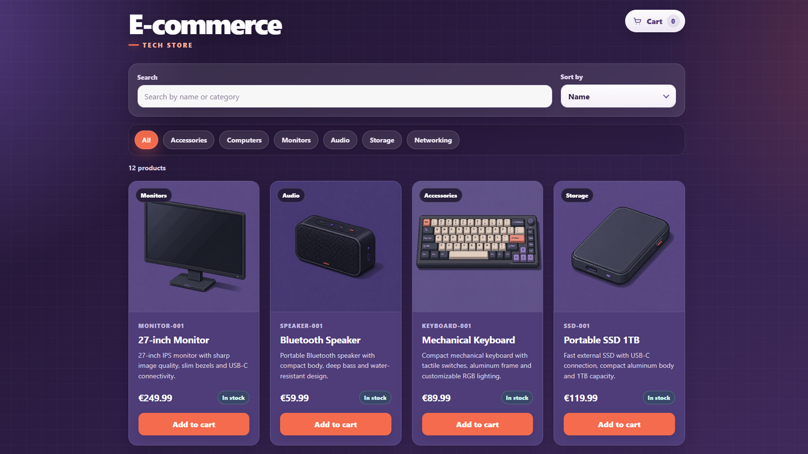
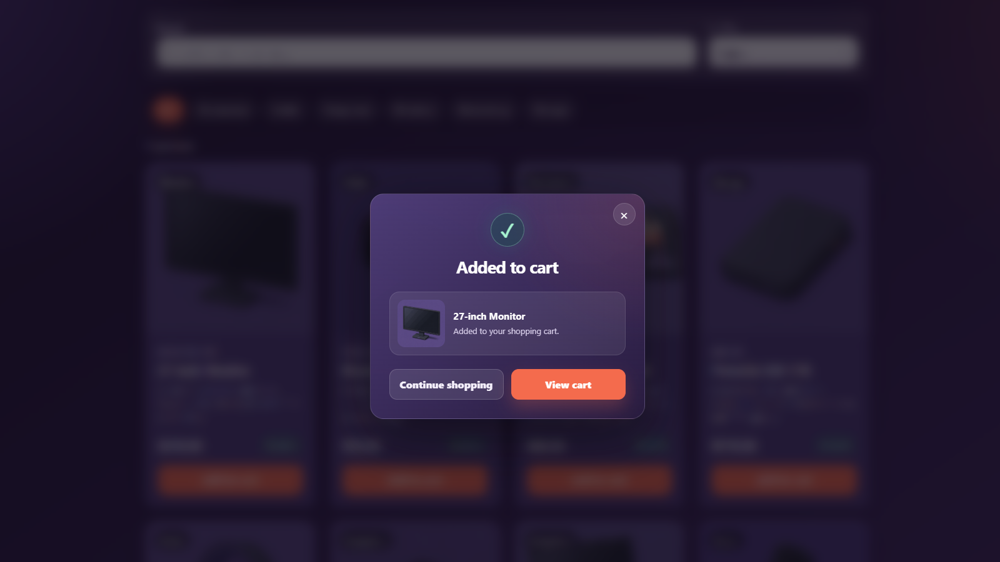
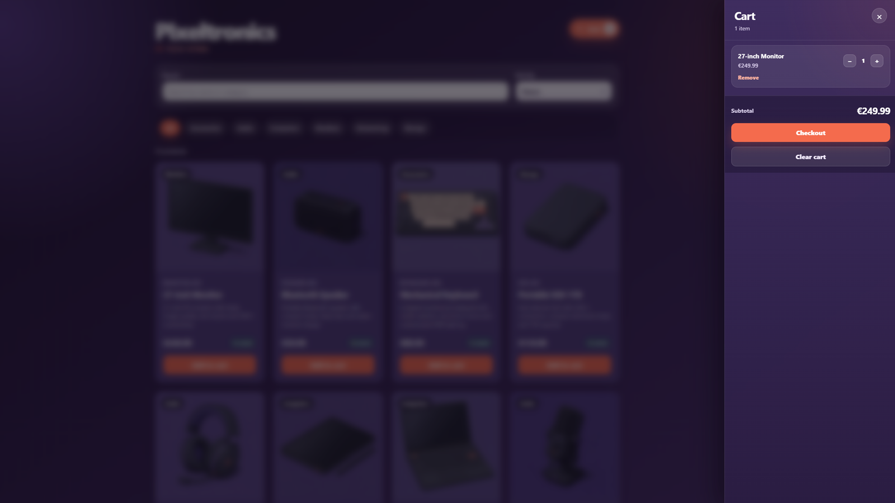
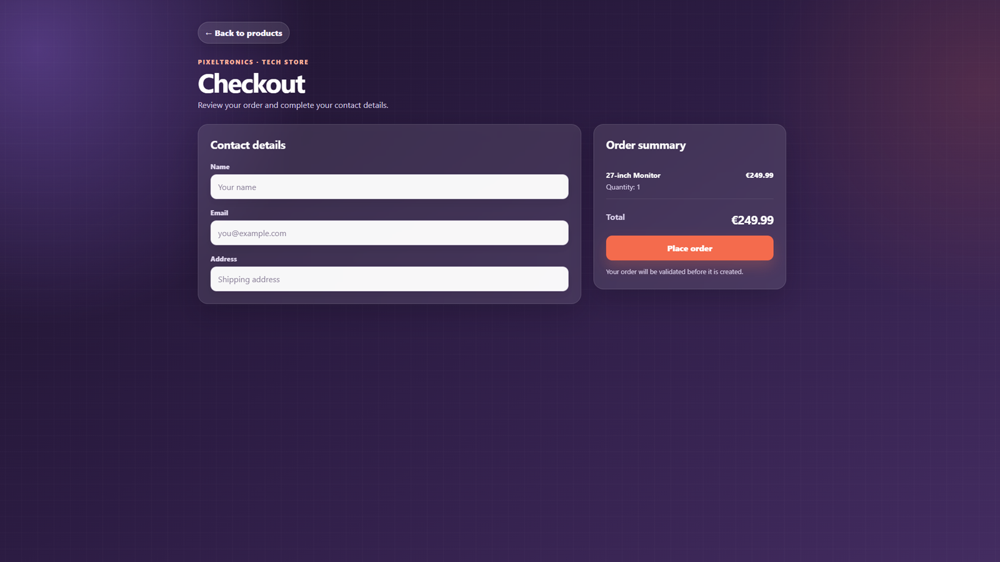
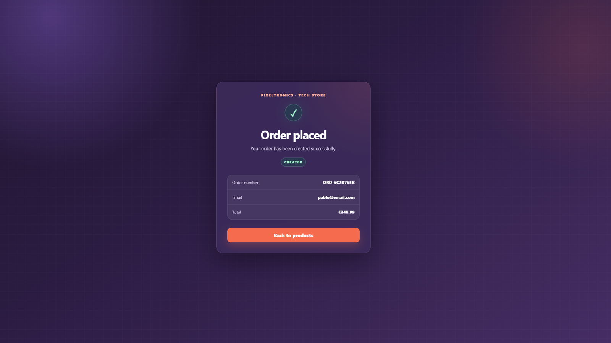
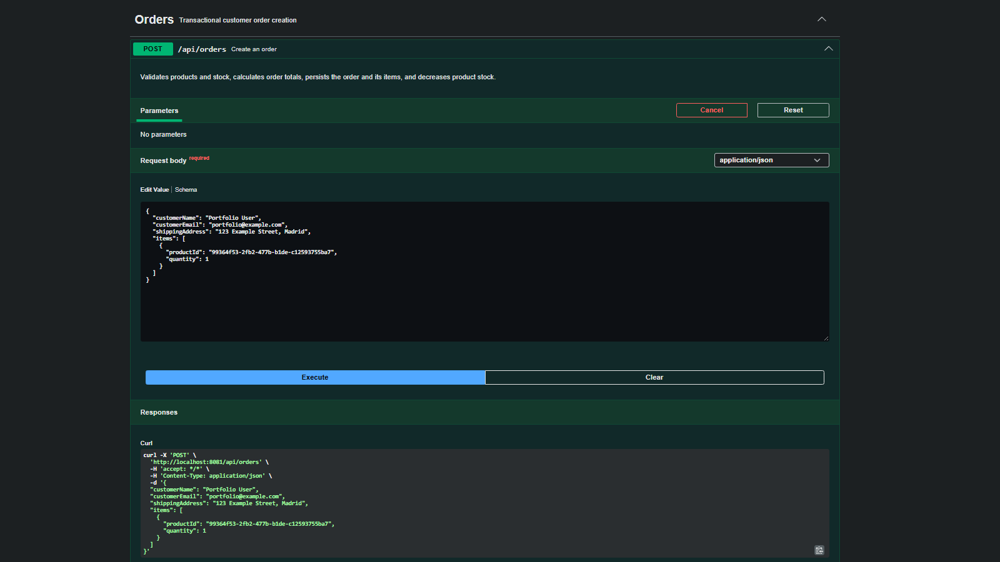
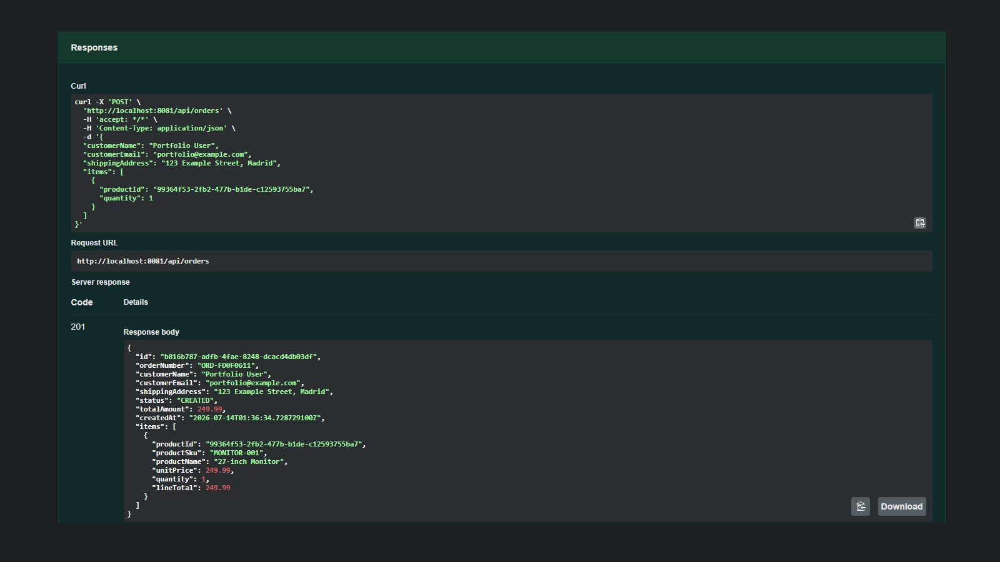

# E-commerce full-stack

Full-stack e-commerce portfolio project built with **Angular 21**, **Spring Boot 4.1**, **Java 21** and **PostgreSQL**.

The application implements a complete catalog-to-order flow: product browsing, search and filtering, a persistent shopping cart, validated checkout, transactional order creation and stock updates.

[View Live Demo](https://ecommerce-pablov.vercel.app/products)



## Main Features

### Product catalog

- Product catalog loaded from the Spring Boot REST API in full-stack mode.
- Seeded product catalog available in frontend demo mode.
- Search by product name or category.
- Category filtering.
- Custom sorting by name and price.
- Product stock visibility.
- Responsive interface with subtle transitions and reduced-motion support.

### Shopping cart

- Add products to the cart.
- Increase and decrease quantities.
- Remove individual items or clear the cart.
- Prevent quantities from exceeding available stock.
- Persist cart state in `localStorage`.
- Synchronize persisted cart data with the current product catalog.

### Checkout

- Dedicated `/checkout` route.
- User-friendly validation for name, email and shipping address.
- Inline validation messages and accessible invalid-field states.
- Order summary with quantities and calculated total.
- Error feedback when an order cannot be created.

### Order processing

In full-stack mode, `POST /api/orders` performs the complete order workflow inside a database transaction:

1. Validates the request body.
2. Loads and validates every requested product.
3. Checks available stock.
4. Calculates line totals and the final order total.
5. Persists the customer order.
6. Persists its order items.
7. Decreases product stock.
8. Returns the created order with HTTP `201 Created`.

Frontend demo mode reproduces the same user-facing flow locally:

1. Validates the requested products and quantities.
2. Checks the locally available stock.
3. Calculates line totals and the final order total.
4. Generates an order number and confirmation.
5. Decreases the locally stored product stock.
6. Preserves demo data in browser storage.

### API documentation

- OpenAPI specification generated with Springdoc.
- Interactive Swagger UI.
- Documented request schemas, response schemas and HTTP status codes.
- Executable API requests from the browser while the backend is running.

## Application Flow

<table>
  <tr>
    <td width="50%">
      <strong>Add-to-cart confirmation</strong><br><br>
      
    </td>
    <td width="50%">
      <strong>Shopping cart</strong><br><br>
      
    </td>
  </tr>
  <tr>
    <td width="50%">
      <strong>Checkout</strong><br><br>
      
    </td>
    <td width="50%">
      <strong>Order confirmation</strong><br><br>
      
    </td>
  </tr>
</table>

## Tech Stack

### Frontend

- Angular 21
- TypeScript
- Standalone components
- Angular signals
- Angular Router
- SCSS
- Browser `localStorage`
- Browser `sessionStorage`
- Environment-based execution modes
- Vercel

### Backend

- Java 21
- Spring Boot 4.1
- Spring Web MVC
- Spring Data JPA
- Hibernate
- PostgreSQL
- Jakarta Bean Validation
- MapStruct
- Lombok
- Springdoc OpenAPI
- Maven

### Testing and Tooling

- JUnit
- Mockito
- Spring Boot integration tests
- MockMvc
- Docker Compose
- GitHub Actions
- npm

## Execution Modes

The frontend supports two execution modes.

### Full-stack mode

The standard local development configuration connects Angular to the Spring Boot API and PostgreSQL database.

```text
Angular application
        |
        | HTTP / JSON
        v
Spring Boot REST API
        |
        | JPA / Hibernate
        v
PostgreSQL
```

This mode provides:

- Real REST API communication.
- Database-backed product and order persistence.
- Transactional order creation.
- Relational order and order-item storage.
- Persistent stock updates.
- Swagger and OpenAPI documentation.

### Frontend demo mode

The public Vercel deployment uses the Angular frontend without requiring a permanently hosted Java backend.

```text
Angular application
        |
        v
DemoStore
        |
        v
localStorage / sessionStorage
```

This mode provides:

- Seeded product and category data.
- Product search, filtering and sorting.
- Persistent shopping cart.
- Stock validation.
- Local stock updates.
- Checkout validation.
- Order total calculation.
- Order-number generation.
- Order confirmation after navigation or page reload.

## Architecture

The backend follows a **feature-based package structure**:

```text
category/
product/
order/
common/
seed/
```

Each feature owns its controllers, services, repositories, entities and DTOs where applicable. This keeps related code together and avoids a large project-wide separation into generic controller, service and repository folders.

The frontend uses focused standalone components:

```text
product-catalog/
product-card/
cart-drawer/
add-to-cart-confirmation/
checkout/
order-confirmation/
```

State and data access are separated into focused services:

- `CartStore` manages cart state and `localStorage` persistence.
- `OrderStore` keeps the latest order response available and temporarily persists it in `sessionStorage`.
- `CatalogApi` loads products and categories from either the backend or the demo store.
- `OrderApi` creates orders through either the REST API or the demo store.
- `DemoStore` reproduces catalog, stock and order behavior for the frontend-only deployment.

Additional architecture notes are available in [`docs/architecture.md`](docs/architecture.md).

## API Documentation

Swagger UI is available while the backend is running:

```text
http://localhost:8081/swagger-ui.html
```

Raw OpenAPI specification:

```text
http://localhost:8081/v3/api-docs
```

### Create-order request

Swagger documents the customer data and order items required by `POST /api/orders`.



### Successful response

A successful request returns HTTP `201 Created` with the persisted order, calculated total and order lines.



## REST Endpoints

| Method | Endpoint | Description |
|---|---|---|
| `GET` | `/api/products` | Returns all products |
| `GET` | `/api/products/{id}` | Returns one product by UUID |
| `GET` | `/api/categories` | Returns all product categories |
| `POST` | `/api/orders` | Validates and creates a customer order |

### Example order request

`productId` must contain the UUID of an existing product returned by `GET /api/products`.

```json
{
  "customerName": "Portfolio User",
  "customerEmail": "portfolio@example.com",
  "shippingAddress": "123 Example Street, Madrid",
  "items": [
    {
      "productId": "99364f53-2fb2-477b-b1de-c12593755ba7",
      "quantity": 1
    }
  ]
}
```

### Example successful response

```json
{
  "id": "b816b787-adfb-4fae-8248-dcacd4db03df",
  "orderNumber": "ORD-FD0F0611",
  "customerName": "Portfolio User",
  "customerEmail": "portfolio@example.com",
  "shippingAddress": "123 Example Street, Madrid",
  "status": "CREATED",
  "totalAmount": 249.99,
  "createdAt": "2026-07-14T01:36:34.728Z",
  "items": [
    {
      "productId": "99364f53-2fb2-477b-b1de-c12593755ba7",
      "productSku": "MONITOR-001",
      "productName": "27-inch Monitor",
      "unitPrice": 249.99,
      "quantity": 1,
      "lineTotal": 249.99
    }
  ]
}
```

## Project Structure

```text
ecommerce-angular-springboot/
├── .github/
│   └── workflows/
│       └── ci.yml
├── backend/
│   ├── src/
│   │   ├── main/
│   │   │   ├── java/com/portfolio/ecommerce/
│   │   │   │   ├── category/
│   │   │   │   ├── common/
│   │   │   │   ├── order/
│   │   │   │   ├── product/
│   │   │   │   └── seed/
│   │   │   └── resources/
│   │   │       ├── seed/products.json
│   │   │       └── application.yaml
│   │   └── test/
│   ├── pom.xml
│   ├── mvnw
│   └── mvnw.cmd
├── frontend/
│   ├── public/
│   │   └── assets/products/
│   ├── src/
│   │   ├── app/
│   │   │   └── features/catalog/
│   │   │       ├── data/
│   │   │       │   ├── catalog-api.ts
│   │   │       │   ├── demo-data.ts
│   │   │       │   ├── demo-store.ts
│   │   │       │   ├── order-api.ts
│   │   │       │   └── order-store.ts
│   │   │       ├── models/
│   │   │       │   └── order.ts
│   │   │       ├── add-to-cart-confirmation/
│   │   │       ├── cart-drawer/
│   │   │       ├── checkout/
│   │   │       ├── order-confirmation/
│   │   │       ├── product-card/
│   │   │       └── product-catalog/
│   │   └── environments/
│   │       ├── environment.ts
│   │       └── environment.development.ts
│   ├── angular.json
│   ├── package.json
│   ├── package-lock.json
│   └── vercel.json
├── docs/
│   ├── architecture.md
│   └── screenshots/
├── compose.yml
└── README.md
```

## Local Development

### Requirements

- Java 21
- Node.js 22
- npm
- Docker Desktop

### 1. Start PostgreSQL

From the project root:

```powershell
docker compose up -d
```

PostgreSQL is exposed locally on:

```text
localhost:5433
```

Local database configuration:

```text
Database: ecommerce_db
User: ecommerce_user
Password: ecommerce_pass
```

These credentials are intended only for the local Docker development environment.

### 2. Start the backend

```powershell
cd backend
.\mvnw.cmd spring-boot:run
```

Backend:

```text
http://localhost:8081
```

Swagger UI:

```text
http://localhost:8081/swagger-ui.html
```

The product seeder loads the catalog from:

```text
backend/src/main/resources/seed/products.json
```

### 3. Start the frontend in full-stack mode

In another terminal:

```powershell
cd frontend
npm ci
npm start
```

Frontend:

```text
http://localhost:4200
```

In this mode, Angular communicates with:

```text
http://localhost:8081/api
```

Main routes:

```text
/products
/checkout
/order-confirmation
```

### 4. Start the frontend in demo mode

The frontend-only mode can be executed without starting Spring Boot or PostgreSQL:

```powershell
cd frontend
npm ci
npm run start:demo
```

Frontend:

```text
http://localhost:4200
```

The demo stores product stock in `localStorage` and the latest order confirmation in `sessionStorage`.

To reset the local demo data, run this in the browser console:

```javascript
localStorage.removeItem('pixeltronics-demo-products-v1');
sessionStorage.removeItem('pixeltronics-last-order');
location.reload();
```

## Testing

### Backend tests

```powershell
cd backend
.\mvnw.cmd clean test
```

The backend test suite covers:

- Successful order creation.
- Order total calculation.
- Order-item persistence.
- Product stock decrement.
- Missing products.
- Insufficient stock.
- Invalid request bodies.
- HTTP `201`, `400` and `404` behavior.

Unit tests isolate `OrderService` with Mockito. Integration tests exercise the order endpoint with Spring Boot and MockMvc.

### Frontend production build

```powershell
cd frontend
npm ci
npm run build
```

The production build is generated in:

```text
frontend/dist/frontend/browser
```

## Deployment

The Angular frontend is deployed on Vercel:

[https://ecommerce-pablov.vercel.app/products](https://ecommerce-pablov.vercel.app/products)

Deployment configuration:

```text
Application preset: Angular
Root directory: frontend
Build command: npm run build
Output directory: dist/frontend/browser
```

The SPA rewrite configuration is defined in:

```text
frontend/vercel.json
```

## Continuous Integration

The GitHub Actions workflow runs on pushes and pull requests targeting `main` or `develop`.

It performs two independent jobs:

1. Starts PostgreSQL and runs the Maven test suite with Java 21.
2. Installs frontend dependencies with `npm ci` and creates the Angular production build with Node.js 22.

Workflow:

```text
.github/workflows/ci.yml
```

## Database Inspection

Open a PostgreSQL shell:

```powershell
docker exec -it ecommerce-postgres psql -U ecommerce_user -d ecommerce_db
```

Useful queries:

```sql
SELECT order_number, customer_email, total_amount, status, created_at
FROM customer_orders
ORDER BY created_at DESC;

SELECT product_sku, product_name, quantity, unit_price, line_total
FROM order_items;

SELECT sku, name, stock
FROM products
ORDER BY name;
```

Exit PostgreSQL:

```sql
\q
```

## Scope

This project is intentionally scoped as a portfolio e-commerce application focused on:

- Angular component architecture and client-side state.
- REST API integration.
- Transactional backend business logic.
- Relational persistence.
- Validation and error handling.
- Automated backend testing.
- Reproducible local execution.
- Interactive API documentation.
- Environment-based frontend execution.
- Public frontend deployment.

Authentication, administration, real payments, invoicing and shipping management are outside the current scope.